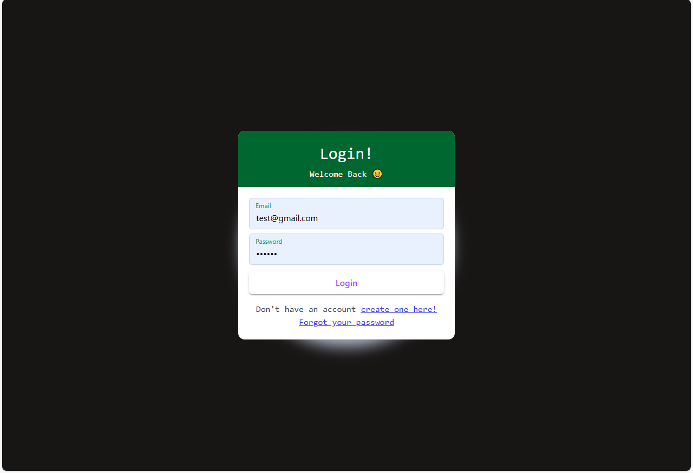
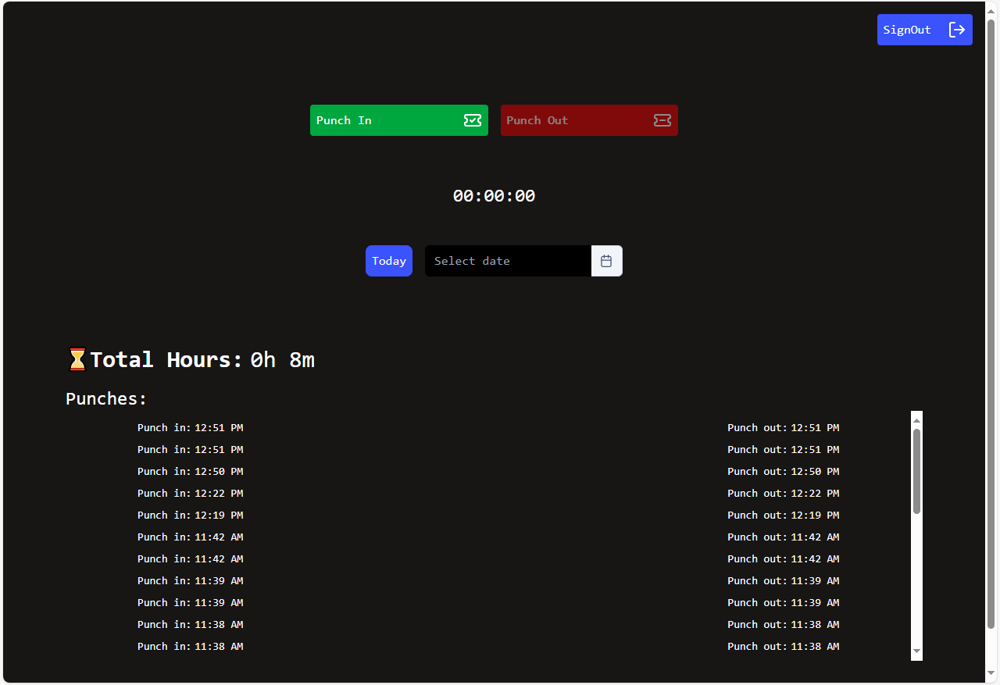
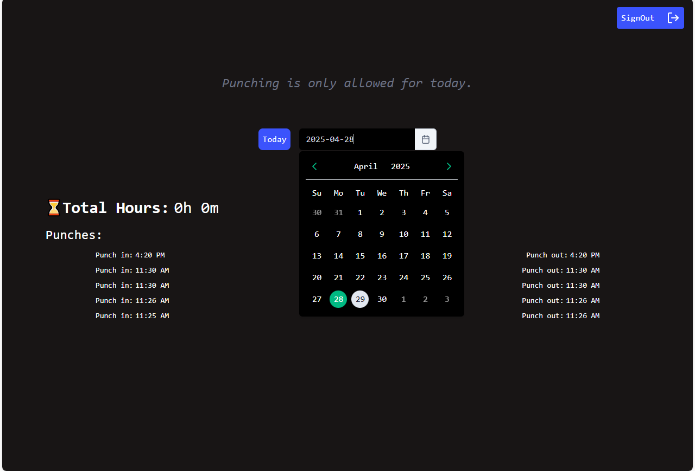

# Frontend
### Based on : 
- **Frontend** - Angular, Tailwind, Prime Ng Component
- **Backend** -  Java Spring Boot
- **Database** - MySql

This project was generated using [Angular CLI](https://github.com/angular/angular-cli) version 19.2.7.


## Images - 
## Images







## Dependencies
```bash
npm i
```

## Development server

To start a local development server - frontend, run:

```bash
ng start
```
To start a local development server - backend:
```bash
start in Intellij
```

Once the server is running, open your browser and navigate to `http://localhost:4200/`, for frontend -  The application will automatically reload whenever you modify any of the source files. 
And for backend `http://localhost:8080/` need to rebuild and restart when files are changed.


## Database -

```bash
CREATE DATABASE your_db_name;
```


## Backend 
In the src/main/resources/application.properties

```bash
spring.application.name=your_db_name
spring.datasource.url=jdbc:mysql://localhost:3306/your_db_name
spring.datasource.username=your_mysql_db_name
spring.datasource.password=your_mysql_password

spring.jpa.hibernate.ddl-auto=update
spring.jpa.show-sql=true
spring.jpa.properties.hibernate.dialect=org.hibernate.dialect.MySQLDialect
```

